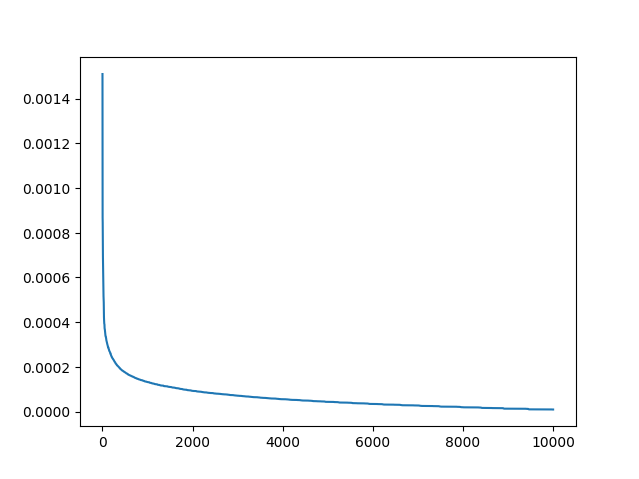
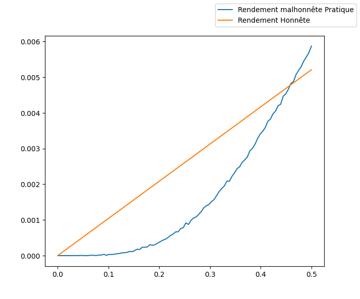
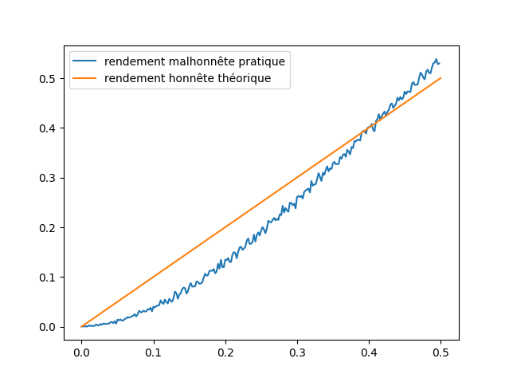
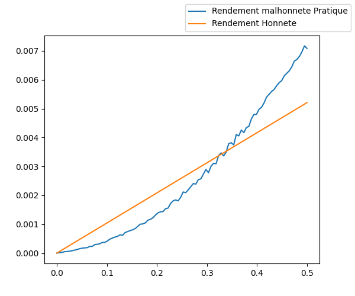
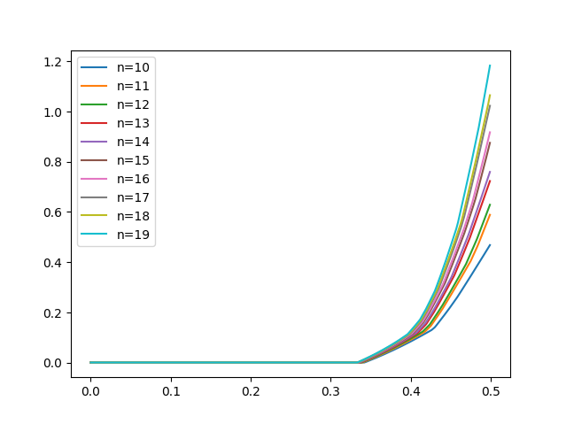
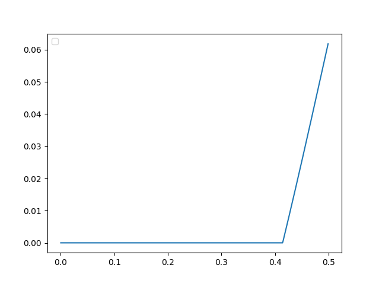
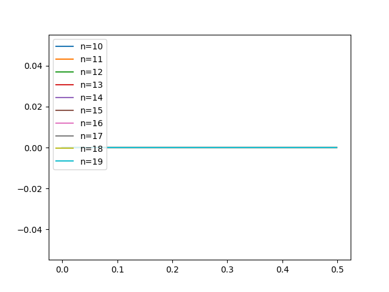

# Cryptofinance

## Proof of work <a name="Proof_of_work"/>
Ce script va simuler une preuve de travail, enregistrer le temps que va mettre la machine à résoudre cette preuve de travail puis va tracer un graphique: 

On remarque que cette courbe ressemble à une loi exponentielle. On effectue également un test de Kolmogorov-Smirnov sur cette courbe

## **Double spend** <a name="Double_spend"/>
Ce script va simuler une double dépense sur bitcoin. Nous étudions une situation où un mineur essaye d'effectuer une double dépense. Pour ce faire il va effectuer un paiement qui va être miné sur la blockchain officielle, tout en minant en secret d'autres blocks où sa transaction n'est pas inclue plus vite que tous les autres mineurs réunis. Une fois que la personne qui a reçu le paiement l'a vu et confirmé l'attaquant va diffuser sa blockchain qui n'inclue pas la transaction et qui est plus grande que la blockchain officielle ce qui fera que son paiement a la premiere personne n'existera plus et il sera libre de redépenser ses UTXOs.

Pour étudier ce processus on doit donc prendre en compte plusieurs paramètres :
* q, la puissance de minage relative de l'attaquant
* n, le nombre de cycles d'attaque
* 
* z, le nombre de confirmations attendu
* A, le nombre de blocks d'écart acceptable entre l'attaquant et la blockchain officielle
* v, le montant de la double dépense

Pour une attaque avec :
* n = 50 000
* z = 4
* A = 5
* v = 10

On obtient ce graphique :

On voit que l'attaque est rentable à partir de 40% de puissance de minage relative

## **1 + 2** <a name="1_+_2"/>
Ce script va simuler une attaque "1 + 2" cette attaque consiste à découvrir le plus de blocs possibles sur un cycle de 3 blocks
Pour simuler cette attaque on prend en paramètres :
* n, le nombre de cycles d'attaque 
* q, la puissance relative de minage de l'attaquant

Lorsque l'on trace la rentabilité en fonction de la puissance de minage relative on obtient ce graphique :

On voit que l'attaque est rentable lorsqu'on possède 42% de la puissance de minage totale de bitcoin

## **Selfish mining** <a name="Selfish_mining"/>
Ce script va simuler une attaque le "Selfish mining" qui consiste à miner sans dévoiler immédiatement ses blocks. L'attaquant va miner en secret jusqu'a ce qu'il se fasse rattraper par la blockchain officielle ou jusqu'a ce qu'il arrête l'attaque. L'attaque prend fin quand le mineur égoïste diffuse ses blocks où lorsqu'il abandonne.
Pour simuler cette attaque on prend en paramètres :
* n, le nombre de cycles d'attaque 
* q, la puissance relative de minage de l'attaquant

Lorsque l'on trace la rentabilité en fonction de la puissance de minage relative on obtient ce graphique :

On voit que l'attaque est rentable lorsqu'on possède 33% de la puissance de minage relative.

## **Minage optimal" <a name="Minage_optimal"/>
Ce script va nous aider à déterminer le gain maximal d'un attaquant sur un cycle de minage.
Ce script prend en paramètres:
* a, le nombre de blocs minés par l'attaquant
* h, la hauteur de la blockchain officielle
* n, la taille du cycle
* q, la puissance relative de minage de l'attaquant
* c, le coût de minage de l'attaquant

Afin de trouver la puissance de minage relative minimale pour que cette attaque soit rentable on trace chaque graph en fonction de la puissance de minage relative. Chaque graph est tracé avec n différent :

On voit que l'attaque commence à être rentable si l'on possède 33% de la puissance de minage relative.

Lorsqu'on lance cette simulation avec les paramètres a = 0, h = 0, n = 3, c = q avec q qui varie on retrouve la valeur 42% qui correspond à celle trouvée lors de l'attaque 1 + 2 :

## **Conclusion**
A travers tous ces résultats on peut voir que la stratégie de minage honnête est la plus optimale lorsqu'on détient un faible part de la puissance de calcul de bitcoin cependant dès qu'une personne détient plus de 33% de la puissance de calcul elle n'a plus intérêt à miner honnêtement sur bitcoin. Cette attaque peut être contrée en tenant compte des blocks orphelins car comme on peut le voir sur ce graphique lorsqu'on tient compte des blocks orphelins la stratégie de minage optimale est la stratégie honnête:

